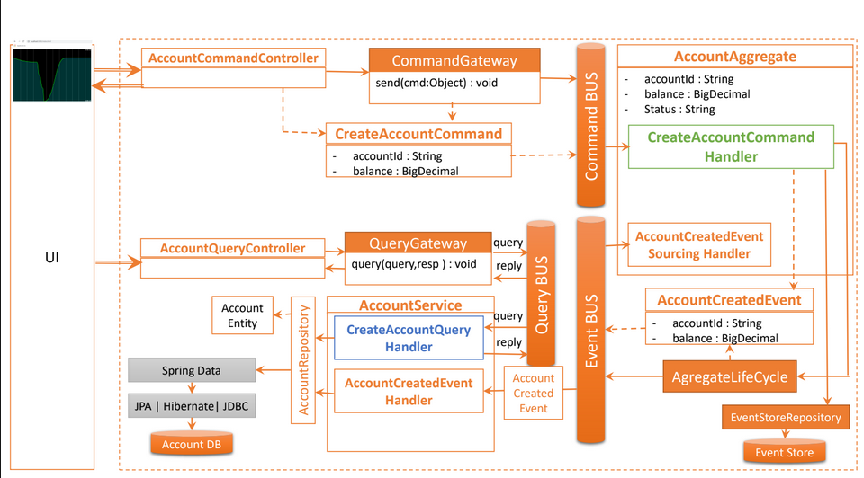
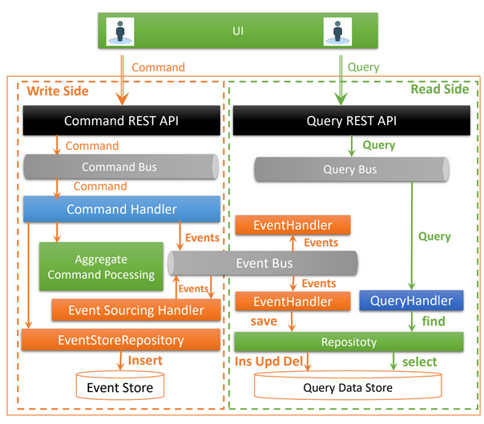

# Documentation Complète du Projet Event Sourcing CQRS Axon

## Table des Matières
1. [Vue d'ensemble du projet](#vue-densemble-du-projet)
2. [Architecture Event Sourcing & CQRS](#architecture-event-sourcing--cqrs)
3. [Technologies utilisées](#technologies-utilisées)
4. [Structure du projet](#structure-du-projet)
5. [Côté Command (Write)](#côté-command-write)
6. [Côté Query (Read)](#côté-query-read)
7. [Axon Framework en détail](#axon-framework-en-détail)
8. [Flux de données](#flux-de-données)
9. [Configuration](#configuration)

---

## Vue d'ensemble du projet



Ce projet implémente un système de **gestion de comptes bancaires** utilisant les patterns **Event Sourcing** et **CQRS** avec **Axon Framework**. Il permet de :
- Créer des comptes bancaires
- Créditer et débiter des comptes
- Modifier le statut des comptes (ACTIVATED, SUSPENDED, BLOCKED)
- Consulter l'historique complet des opérations
- Suivre en temps réel les opérations (via Server-Sent Events)

---

## Architecture Event Sourcing & CQRS



### Qu'est-ce que CQRS ?

**CQRS** (Command Query Responsibility Segregation) sépare les opérations de **lecture** et d'**écriture** :

#### Command Side (Écriture)
- Traite les **commandes** qui modifient l'état
- Valide la logique métier
- Génère des **événements**
- N'a PAS de base de données traditionnelle

#### Query Side (Lecture)
- Traite les **requêtes** pour consulter les données
- Maintient une vue matérialisée dans une base de données
- Optimisé pour la lecture
- Consomme les événements du Command Side

```
┌─────────────────────────────────────────────────────────────────┐
│                         CLIENT (REST API)                        │
└─────────────────────────────────────────────────────────────────┘
           │                                      │
           │ Commands                             │ Queries
           ▼                                      ▼
┌──────────────────────────┐          ┌─────────────────────────┐
│   COMMAND SIDE (Write)   │          │  QUERY SIDE (Read)      │
│                          │          │                         │
│  - Commands              │          │  - Queries              │
│  - Aggregates            │          │  - Query Handlers       │
│  - Command Handlers      │          │  - Read Database        │
│  - Business Logic        │          │  - Projections          │
└──────────────────────────┘          └─────────────────────────┘
           │                                      ▲
           │ Events                               │ Events
           ▼                                      │
┌─────────────────────────────────────────────────────────────────┐
│                    AXON SERVER (Event Store)                     │
│                  Stocke tous les événements                      │
└─────────────────────────────────────────────────────────────────┘
```

### Qu'est-ce que l'Event Sourcing ?

Au lieu de stocker l'**état actuel**, l'Event Sourcing stocke la **séquence complète d'événements** qui ont conduit à cet état.

#### Exemple traditionnel :
```
Account { id: "123", balance: 500 }
```
On perd l'historique des opérations

#### Avec Event Sourcing :
```
1. AccountCreatedEvent    { balance: 0 }
2. AccountCreditedEvent   { amount: 1000 }
3. AccountDebitedEvent    { amount: 200 }
4. AccountDebitedEvent    { amount: 300 }
→ État reconstruit: balance = 500
```
- Historique complet préservé
- Audit trail naturel
- Possibilité de rejouer les événements
- Débogage facilité

---

## Technologies utilisées

### Framework & Bibliothèques
| Technologie | Version | Rôle |
|------------|---------|------|
| **Spring Boot** | 3.4.12 | Framework principal |
| **Axon Framework** | 4.10.3 | Event Sourcing & CQRS |
| **Spring Data JPA** | - | Persistance (Query Side) |
| **PostgreSQL** | Latest | Base de données (Query Side) |
| **H2** | - | Base de données en mémoire (optionnel) |
| **Lombok** | - | Réduction du code boilerplate |
| **SpringDoc OpenAPI** | 2.8.4 | Documentation API |
| **Project Reactor** | 3.7.2 | Programmation réactive |
| **Axon Server** | Latest | Event Store & Message Routing |

### Infrastructure (Docker Compose)
- **Axon Server** : Port 8024 (HTTP), 8124 (gRPC)
- **PostgreSQL** : Port 5432
- **PgAdmin** : Port 8088

---

## Structure du projet

```
src/main/java/ma/abdellah_el_moutaouakil/eventsourcingcqrsaxon/
│
├── command/                           # COMMAND SIDE (Write)
│   ├── aggregates/
│   │   └── AccountAggregate.java      # Cœur de la logique métier
│   ├── commands/
│   │   ├── AddAccountCommand.java     # Créer un compte
│   │   ├── CreditAccountCommand.java  # Créditer
│   │   ├── DebitAccountCommand.java   # Débiter
│   │   └── UpdateAccountStatusCommand.java
│   ├── controllers/
│   │   └── AccountCommandController.java  # REST API pour commands
│   └── dtos/
│       └── ...RequestDTO.java
│
├── query/                             # QUERY SIDE (Read)
│   ├── controllers/
│   │   └── AccountQueryController.java    # REST API pour queries
│   ├── entities/
│   │   ├── Account.java                   # Entité JPA
│   │   └── AccountOperation.java          # Opération bancaire
│   ├── handlers/
│   │   ├── AccountEventHandler.java       # Écoute les événements
│   │   └── AccountQueryHandler.java       # Traite les requêtes
│   ├── queries/
│   │   ├── GetAllAccountsQuery.java
│   │   ├── GetAccountStatementQuery.java
│   │   └── WatchEventQuery.java
│   ├── repositories/
│   │   ├── AccountRepository.java
│   │   └── OperationRepository.java
│   └── dtos/
│       └── AccountStatementResponseDTO.java
│
├── events/                            # ÉVÉNEMENTS
│   ├── AccountCreatedEvent.java
│   ├── AccountActivatedEvent.java
│   ├── AccountCreditedEvent.java
│   ├── AccountDebitedEvent.java
│   └── AccountUpdateStatusEvent.java
│
└── enums/
    └── AccountStatus.java             # CREATED, ACTIVATED, SUSPENDED, BLOCKED
```

---

## Côté Command (Write)

### 1. Commands (Les intentions)

Les **Commands** représentent l'**intention** de faire quelque chose :

```java
@Getter @AllArgsConstructor
public class AddAccountCommand {
    @TargetAggregateIdentifier  // Indique l'ID de l'agrégat cible
    private String id;
    private double initialBalance;
    private String currency;
}
```

**Points clés :**
- `@TargetAggregateIdentifier` : Indique à Axon quel agrégat doit traiter cette commande
- Immutables (final via Lombok)
- Contiennent toutes les données nécessaires à l'action

### 2. AccountAggregate (Le cœur métier)

L'**Aggregate** est le gardien de la logique métier et de la cohérence :

```java
@Aggregate
public class AccountAggregate {
    @AggregateIdentifier
    private String accountId;
    private double balance;
    private AccountStatus status;

    // Constructeur obligatoire pour Axon
    public AccountAggregate(){}

    // COMMAND HANDLER - Traite la création de compte
    @CommandHandler
    public AccountAggregate(AddAccountCommand command) {
        // 1. VALIDATION
        if(command.getInitialBalance()<=0) 
            throw new IllegalArgumentException("Initial Balance must be positive");
        
        // 2. GÉNÉRATION D'ÉVÉNEMENTS (pas de modification directe de l'état !)
        AggregateLifecycle.apply(new AccountCreatedEvent(...));
        AggregateLifecycle.apply(new AccountActivatedEvent(...));
    }

    // EVENT SOURCING HANDLER - Reconstruit l'état à partir des événements
    @EventSourcingHandler
    public void on(AccountCreatedEvent event){
        this.accountId = event.getAccountId();
        this.balance = event.getInitialBalance();
        this.status = event.getAccountStatus();
    }

    // COMMAND HANDLER - Créditer un compte
    @CommandHandler
    public void handle(CreditAccountCommand command){
        // Validation
        if (!this.status.equals(AccountStatus.ACTIVATED)) 
            throw new RuntimeException("Account not activated");
        if(command.getAmount()<=0) 
            throw new IllegalArgumentException("Amount must be positive");
        
        // Génération d'événement
        AggregateLifecycle.apply(new AccountCreditedEvent(...));
    }

    @EventSourcingHandler
    public void on(AccountCreditedEvent event){
        this.balance += event.getAmount();  // Mise à jour de l'état
    }
}
```

**Principe fondamental :**
```
Command Handler → Validation → Apply Event → Event Handler → Update State
     ↓                                              ↑
  Ne modifie                                   Seul endroit où
  PAS l'état                                   l'état est modifié
```

### 3. AccountCommandController (API REST)

```java
@RestController
@RequestMapping("/commands/accounts")
public class AccountCommandController {
    private CommandGateway commandGateway;  // Point d'entrée Axon
    private EventStore eventStore;

    @PostMapping
    public CompletableFuture<String> addNewAccount(@RequestBody AddNewAccountRequestDTO request) {
        // Envoi asynchrone de la commande
        return commandGateway.send(
            new AddAccountCommand(UUID.randomUUID().toString(), ...)
        );
    }

    @PostMapping("/credit")
    public CompletableFuture<String> creditAccount(@RequestBody CreditAccountDTO request){
        return commandGateway.send(new CreditAccountCommand(...));
    }

    @GetMapping("/events/{accountId}")
    public Stream eventStore(@PathVariable String accountId){
        // Retourne TOUS les événements pour un compte
        return eventStore.readEvents(accountId).asStream();
    }
}
```

---

## Côté Query (Read)

### 1. Entités JPA (Vue matérialisée)

```java
@Entity
@Getter @Setter @NoArgsConstructor @AllArgsConstructor @Builder
public class Account {
    @Id
    private String id;
    private double balance;
    private Instant createdAt;
    @Enumerated(EnumType.STRING)
    private AccountStatus status;
    private String currency;
}

@Entity
public class AccountOperation {
    @Id @GeneratedValue(strategy= GenerationType.IDENTITY)
    private Long id;
    private Instant date;
    private double amount;
    @Enumerated(EnumType.STRING)
    private OperationType type;  // CREDIT ou DEBIT
    @ManyToOne
    private Account account;
}
```

**Important :** Ces entités sont une **projection** des événements, pas la source de vérité !

### 2. AccountEventHandler (Consomme les événements)

```java
@Component
public class AccountEventHandler {
    private AccountRepository accountRepository;
    private OperationRepository operationRepository;
    private QueryUpdateEmitter queryUpdateEmitter;  // Pour les mises à jour en temps réel

    // Écoute les événements et met à jour la base de données
    @EventHandler
    public void on(AccountCreatedEvent event, EventMessage eventMessage) {
        Account account = Account.builder()
            .id(event.getAccountId())
            .balance(event.getInitialBalance())
            .createdAt(eventMessage.getTimestamp())  // Timestamp de l'événement
            .build();
        accountRepository.save(account);
    }

    @EventHandler
    public void on(AccountCreditedEvent event, EventMessage eventMessage) {
        // 1. Récupérer le compte
        Account account = accountRepository.findById(event.getAccountId()).get();
        
        // 2. Créer l'opération
        AccountOperation operation = AccountOperation.builder()
            .type(OperationType.CREDIT)
            .amount(event.getAmount())
            .date(eventMessage.getTimestamp())
            .account(account)
            .build();
        operationRepository.save(operation);
        
        // 3. Mettre à jour le solde
        account.setBalance(account.getBalance() + event.getAmount());
        accountRepository.save(account);
        
        // 4. Émettre une mise à jour pour les abonnés en temps réel
        queryUpdateEmitter.emit(e -> true, operation);
    }
}
```

### 3. Queries & QueryHandler

```java
@Getter @AllArgsConstructor
public class GetAllAccountsQuery {}

@Getter @AllArgsConstructor
public class GetAccountStatementQuery {
    private String accountId;
}

@Component
public class AccountQueryHandler {
    @QueryHandler
    public List<Account> on(GetAllAccountsQuery query){
        return accountRepository.findAll();
    }

    @QueryHandler
    public AccountStatementResponseDTO on(GetAccountStatementQuery query){
        Account account = accountRepository.findById(query.getAccountId()).get();
        List<AccountOperation> operations = operationRepository.findByAccountId(account.getId());
        return new AccountStatementResponseDTO(account, operations);
    }
}
```

### 4. AccountQueryController (API REST)

```java
@RestController
@RequestMapping("/query/accounts")
public class AccountQueryController {
    private QueryGateway queryGateway;  // Point d'entrée Axon

    @GetMapping("/all")
    public CompletableFuture<List<Account>> getAllAccounts() {
        return queryGateway.query(
            new GetAllAccountsQuery(), 
            ResponseTypes.multipleInstancesOf(Account.class)
        );
    }

    @GetMapping("/accountStatement/{accountId}")
    public CompletableFuture<AccountStatementResponseDTO> getAccountStatement(@PathVariable String accountId) {
        return queryGateway.query(
            new GetAccountStatementQuery(accountId),
            ResponseTypes.instanceOf(AccountStatementResponseDTO.class)
        );
    }

    // STREAMING EN TEMPS RÉEL (Server-Sent Events)
    @GetMapping(value = "/watch/{accountId}", produces = MediaType.TEXT_EVENT_STREAM_VALUE)
    public Flux<AccountOperation> watch(@PathVariable String accountId){
        SubscriptionQueryResult<AccountOperation, AccountOperation> result = 
            queryGateway.subscriptionQuery(
                new WatchEventQuery(accountId),
                ResponseTypes.instanceOf(AccountOperation.class),
                ResponseTypes.instanceOf(AccountOperation.class)
            );
        
        // Retourne l'état initial + les mises à jour en temps réel
        return result.initialResult().concatWith(result.updates());
    }
}
```

---

## Axon Framework en détail

### Composants clés d'Axon

#### 1. **CommandGateway**
```java
commandGateway.send(new AddAccountCommand(...))
```
- Point d'entrée pour envoyer des commandes
- Gère l'acheminement vers le bon Aggregate
- Retourne `CompletableFuture` (asynchrone)

#### 2. **QueryGateway**
```java
queryGateway.query(new GetAllAccountsQuery(), ResponseTypes.multipleInstancesOf(Account.class))
```
- Point d'entrée pour envoyer des requêtes
- Gère l'acheminement vers le bon QueryHandler

#### 3. **EventStore**
```java
eventStore.readEvents(accountId).asStream()
```
- Stocke TOUS les événements de manière immuable
- Permet de reconstruire l'état complet d'un agrégat
- Fourni par **Axon Server**

#### 4. **QueryUpdateEmitter**
```java
queryUpdateEmitter.emit(e -> true, operation)
```
- Permet les mises à jour en temps réel
- Utilisé pour les **Subscription Queries**

### Annotations Axon

| Annotation | Rôle |
|------------|------|
| `@Aggregate` | Marque une classe comme agrégat |
| `@AggregateIdentifier` | Identifie l'ID unique de l'agrégat |
| `@CommandHandler` | Méthode qui traite une commande |
| `@EventSourcingHandler` | Méthode qui applique un événement à l'état |
| `@EventHandler` | Méthode qui écoute un événement (Query Side) |
| `@QueryHandler` | Méthode qui traite une requête |
| `@TargetAggregateIdentifier` | Identifie l'agrégat cible dans une commande |

### Cycle de vie d'une commande

```
1. Client envoie une commande via REST API
         ↓
2. Controller utilise CommandGateway.send(command)
         ↓
3. Axon route la commande vers l'Aggregate approprié
         ↓
4. @CommandHandler valide et génère des événements
         ↓
5. Événements stockés dans l'EventStore (Axon Server)
         ↓
6. @EventSourcingHandler met à jour l'état de l'Aggregate
         ↓
7. Événements diffusés à tous les @EventHandler (Query Side)
         ↓
8. Query Side met à jour la base de données PostgreSQL
         ↓
9. QueryUpdateEmitter notifie les abonnés en temps réel
```

---

## Flux de données complet

### Exemple : Créer et créditer un compte

#### Étape 1 : Créer un compte
```
POST /commands/accounts
{
  "initialBalance": 1000,
  "currency": "MAD"
}

Flow:
1. AccountCommandController.addNewAccount()
2. CommandGateway.send(AddAccountCommand)
3. AccountAggregate constructor (CommandHandler)
   - Validation: initialBalance > 0
   - Apply AccountCreatedEvent
   - Apply AccountActivatedEvent
4. EventStore stocke les événements
5. AccountAggregate.on(AccountCreatedEvent) → state: balance=1000, status=CREATED
6. AccountAggregate.on(AccountActivatedEvent) → state: status=ACTIVATED
7. AccountEventHandler.on(AccountCreatedEvent) → INSERT INTO account
8. AccountEventHandler.on(AccountActivatedEvent) → UPDATE account SET status=ACTIVATED
```

#### Étape 2 : Créditer le compte
```
POST /commands/accounts/credit
{
  "accountId": "abc-123",
  "amount": 500,
  "currency": "MAD"
}

Flow:
1. AccountCommandController.creditAccount()
2. CommandGateway.send(CreditAccountCommand)
3. Axon charge l'Aggregate depuis l'EventStore (replay des événements)
4. AccountAggregate.handle(CreditAccountCommand)
   - Validation: status == ACTIVATED
   - Validation: amount > 0
   - Apply AccountCreditedEvent
5. EventStore stocke AccountCreditedEvent
6. AccountAggregate.on(AccountCreditedEvent) → balance += 500
7. AccountEventHandler.on(AccountCreditedEvent)
   - INSERT INTO account_operation
   - UPDATE account SET balance = balance + 500
   - queryUpdateEmitter.emit(operation) → Notifie les watchers
```

#### Étape 3 : Consulter le relevé
```
GET /query/accounts/accountStatement/abc-123

Flow:
1. AccountQueryController.getAccountStatement()
2. QueryGateway.query(GetAccountStatementQuery)
3. AccountQueryHandler.on(GetAccountStatementQuery)
4. SELECT * FROM account WHERE id = 'abc-123'
5. SELECT * FROM account_operation WHERE account_id = 'abc-123'
6. Return AccountStatementResponseDTO
```

#### Étape 4 : Suivre les opérations en temps réel
```
GET /query/accounts/watch/abc-123 (SSE)

Flow:
1. AccountQueryController.watch()
2. QueryGateway.subscriptionQuery(WatchEventQuery)
3. Retourne état initial + écoute les mises à jour
4. Quand AccountEventHandler.on(AccountCreditedEvent) appelle queryUpdateEmitter.emit()
   → Le client reçoit immédiatement la nouvelle opération via SSE
```

---

## Configuration

### application.properties
```properties
# PostgreSQL (Query Side)
spring.datasource.url=jdbc:postgresql://localhost:5432/accounts_db
spring.datasource.username=admin
spring.datasource.password=1234
spring.jpa.hibernate.ddl-auto=update

# Axon Serialization
axon.serializer.events=jackson        # Événements en JSON
axon.serializer.messages=xstream      # Messages internes en XML
axon.serializer.general=jackson       # Général en JSON
```

### Docker Compose
```yaml
services:
  axonserver:
    image: 'axoniq/axonserver:latest'
    ports:
      - '8024:8024'  # UI Web
      - '8124:8124'  # gRPC
    environment:
      - 'AXONIQ_AXONSERVER_STANDALONE=TRUE'

  postgres:
    image: 'postgres:latest'
    ports:
      - '5432:5432'
    environment:
      - 'POSTGRES_DB=accounts_db'
      - 'POSTGRES_USER=admin'
      - 'POSTGRES_PASSWORD=1234'

  pgadmin4:
    image: dpage/pgadmin4
    ports:
      - "8088:80"
    environment:
      PGADMIN_DEFAULT_EMAIL: abde@gmail.com
      PGADMIN_DEFAULT_PASSWORD: azer
```

---

## Concepts avancés

### 1. **Event Replay (Rejeu d'événements)**
Si la base de données Query Side est corrompue, vous pouvez :
```java
// Reconstruire l'état complet depuis l'Event Store
eventStore.readEvents(accountId).asStream()
    .forEach(event -> accountEventHandler.on(event));
```

### 2. **Eventual Consistency (Cohérence à terme)**
- Command Side et Query Side ne sont PAS synchrones
- Il peut y avoir un léger décalage (millisecondes)
- Acceptable dans la plupart des cas d'usage

### 3. **Snapshot (Optimisation)**
Pour éviter de rejouer des milliers d'événements :
```java
@Aggregate(snapshotTriggerDefinition = "accountSnapshotTrigger")
public class AccountAggregate {
    // Axon crée un snapshot tous les X événements
}
```

### 4. **Saga (Transactions distribuées)**
Pour orchestrer des processus métier complexes :
```java
@Saga
public class TransferSaga {
    @SagaEventHandler(associationProperty = "transferId")
    public void on(TransferInitiatedEvent event) {
        // Débiter compte source
        // Créditer compte destination
        // Gérer les compensations en cas d'échec
    }
}
```

---

## Avantages de cette architecture

### Event Sourcing
- **Audit trail complet** : Chaque changement est tracé
- **Débogage facilité** : Rejouez les événements pour reproduire un bug
- **Analyse temporelle** : "Quel était l'état du compte le 1er janvier ?"
- **Compliance** : Requis dans la finance

### CQRS
- **Scalabilité** : Read et Write peuvent scale indépendamment
- **Performance** : Requêtes optimisées (pas de JOINs complexes)
- **Flexibilité** : Plusieurs modèles de lecture pour différents besoins
- **Sécurité** : Séparation des responsabilités

### Axon Framework
- **Moins de code boilerplate** : Gère le plumbing
- **Event Store intégré** : Axon Server
- **Scalabilité horizontale** : Clustering natif
- **Outils de monitoring** : Axon Dashboard

---

## Pour aller plus loin

### Améliorations possibles :
1. **Sécurité** : Ajouter Spring Security + OAuth2
2. **Multi-tenancy** : Support de plusieurs organisations
3. **Snapshots** : Optimiser la reconstruction des agrégats
4. **Sagas** : Gérer les transferts inter-comptes
5. **Event Upcasting** : Évolution du schéma des événements
6. **Projections multiples** : Vues matérialisées spécialisées
7. **Dead Letter Queue** : Gestion des événements en échec
8. **Monitoring** : Prometheus + Grafana

---

## Ressources

- [Axon Framework Documentation](https://docs.axoniq.io/)
- [CQRS Pattern - Martin Fowler](https://martinfowler.com/bliki/CQRS.html)
- [Event Sourcing - Greg Young](https://www.eventstore.com/event-sourcing)
- [DDD (Domain-Driven Design)](https://www.domainlanguage.com/ddd/)

---

## Conclusion

Ce projet illustre parfaitement comment **Event Sourcing**, **CQRS** et **Axon Framework** travaillent ensemble pour créer une architecture :
- **Auditable** : Chaque opération est tracée
- **Scalable** : Read et Write indépendants
- **Résiliente** : Reconstruction possible à tout moment
- **Performante** : Requêtes optimisées
- **Maintenable** : Séparation claire des responsabilités

**Event Sourcing + CQRS + Axon = Architecture moderne pour systèmes critiques**

